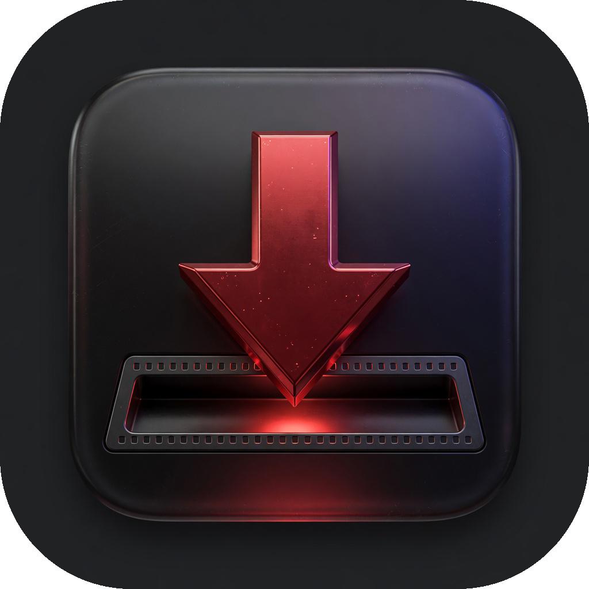
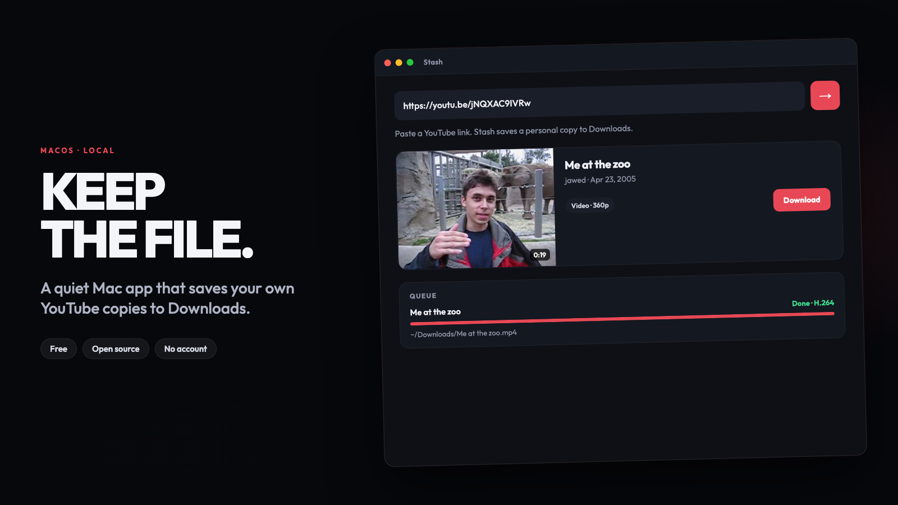

<p align="center">
  
</p>

# Stash

**Paste a YouTube link. Hit download. A playable MP4 lands in Downloads.**

No account. No cloud. No API keys. It only runs on your machine (`127.0.0.1`).

The zip already includes Node, ffmpeg, and yt-dlp. You do **not** install anything else.

Use this for personal copies of videos you’re allowed to download. Respect YouTube’s terms and the creator’s rights.

<p align="center">
  
</p>

<p align="center">
  <a href="https://github.com/Surflick/stash/releases/download/v1.3.0/Stash-macOS.zip"><strong>Download for Mac</strong></a>
  &nbsp;·&nbsp;
  <a href="https://github.com/Surflick/stash/releases/download/v1.3.0/Stash-windows.zip"><strong>Download for Windows</strong></a>
  &nbsp;·&nbsp;
  <a href="https://github.com/Surflick/stash/releases/tag/v1.3.0">Release notes</a>
</p>

## Download

| | File | Size |
| --- | --- | --- |
| **Mac** (Apple Silicon + Intel) | [Stash-macOS.zip](https://github.com/Surflick/stash/releases/download/v1.3.0/Stash-macOS.zip) | ~234 MB |
| **Windows** (64-bit) | [Stash-windows.zip](https://github.com/Surflick/stash/releases/download/v1.3.0/Stash-windows.zip) | ~108 MB |

Current release: **[v1.3.0](https://github.com/Surflick/stash/releases/tag/v1.3.0)**

## Mac

1. Unzip **Stash-macOS.zip**. Keep the whole **Stash** folder together — don’t drag `Stash.app` out by itself.
2. Right-click **Stash.app** → **Open** → **Open** (macOS will warn because it isn’t signed by Apple).
3. Or double-click **Open Stash.command**.

Files land in `~/Downloads` as H.264 MP4 so QuickTime shows the picture, not a black screen with audio.

### If macOS blocks it

Right-click the app → Open. Or double-click **Fix macOS warning** in the unzipped folder.

## Windows

1. Unzip **Stash-windows.zip**. Keep the whole **Stash** folder together.
2. Double-click **Open Stash.bat**.
3. If SmartScreen warns, click **More info** → **Run anyway**. Leave the black window open while you use it.

Files land in your **Downloads** folder.

## What it does

- Fetches title, thumbnail, duration, and available qualities
- Downloads video (H.264 MP4) or audio (M4A / MP3)
- Queue with live progress
- Playlists (this video vs whole list)
- Library of finished files — open, reveal, or hit × to delete (removes the file). Select several to delete at once
- Queue — cancel, retry, or hit × to drop a row. Select several to clear them. × on a finished item also removes the file
- Nothing phones home. No sign-in. Recipients never need API keys.

## Developing on this Mac

Your own copy can keep using Homebrew Node / ffmpeg / yt-dlp. The vendor folder is only inside the giveaway zips.

```bash
npm install
npm start
# → http://127.0.0.1:47841
```

Rebuild the giveaway zips:

```bash
./scripts/package.sh
```

## License

[MIT](LICENSE). Bundled Node, ffmpeg, and yt-dlp keep their own licenses (see `THIRD_PARTY.txt` inside the zip).
